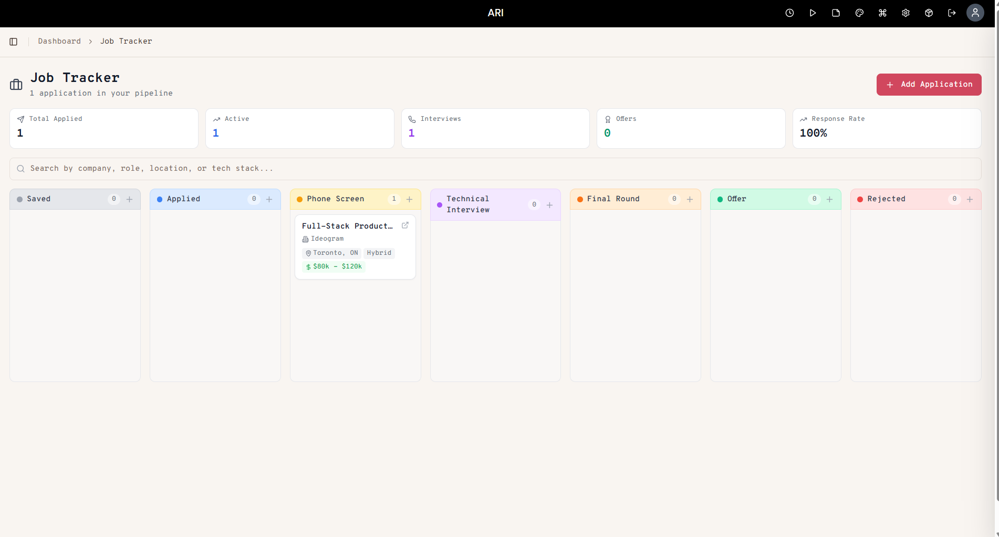
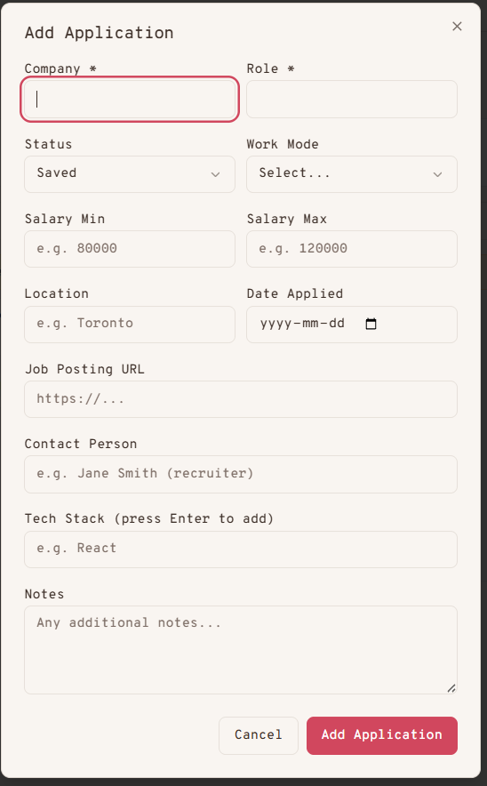
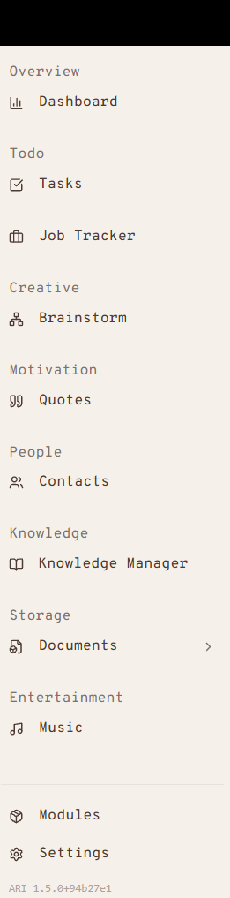

# Job Tracker - ARI Module

A kanban-board module for [ARI](https://ari.software) that helps developers track job applications through the hiring pipeline.

## Problem

When applying to multiple companies, it's easy to lose track of where you stand with each one. Spreadsheets get messy, and most job trackers are either too complex or not designed for developers.

## Solution

Job Tracker gives you a visual kanban board with 7 stages that map to a real hiring pipeline. Drag applications between columns as you progress, and see your entire job search at a glance.

## Features

- **Kanban board** with 7 stages: Saved, Applied, Phone Screen, Technical Interview, Final Round, Offer, Rejected
- **Drag and drop** to move applications between stages
- **Dev-focused fields**: company, role, salary range, location, work mode (remote/hybrid/onsite), tech stack tags, job posting URL, contact person, notes
- **Stats dashboard** showing total applications, active count, interviews, offers, and response rate
- **Search and filter** by company, role, location, or tech stack
- **Dashboard widget** for at-a-glance pipeline summary on the ARI home screen
- **Color-coded columns** for quick visual scanning
- Full row-level security for data isolation

## Tech Stack

- Next.js 16 (App Router)
- TypeScript
- Drizzle ORM
- PostgreSQL with RLS
- @dnd-kit (drag and drop)
- Zod (validation)
- Tailwind CSS

## Installation

1. Copy this module folder into your ARI installation under `modules-custom/job-tracker/`
2. Run `node scripts/generate-module-registry.js` from the ARI root
3. Restart ARI
4. Go to Settings > Modules and enable Job Tracker

## Screenshots

### Kanban Board



### Add Application Modal



### Sidebar Integration



## File Structure

```
job-tracker/
  module.json                    - Module manifest
  app/page.tsx                   - Main kanban page with stats and search
  api/applications/route.ts      - CRUD API endpoints
  components/
    kanban-board.tsx              - Board with drag-and-drop columns
    application-card.tsx          - Draggable application card
    application-modal.tsx         - Create/edit form modal
    widget.tsx                   - Dashboard widget
  database/
    schema.sql                   - Idempotent SQL with RLS policies
    schema.ts                    - Drizzle ORM table definition
    uninstall.sql                - Manual teardown script
  lib/validation.ts              - Zod schemas
  types/index.ts                 - TypeScript interfaces and constants
```

## Author

Vy Nguyen
